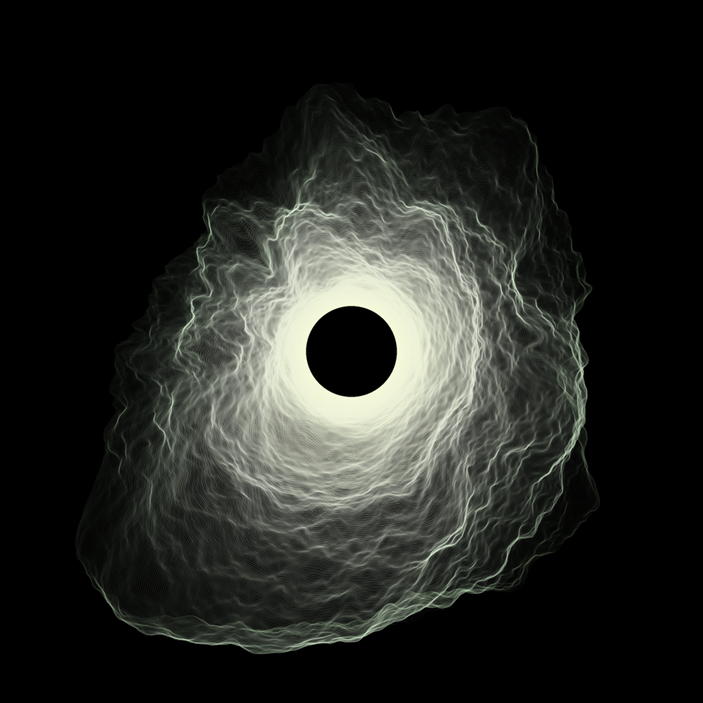
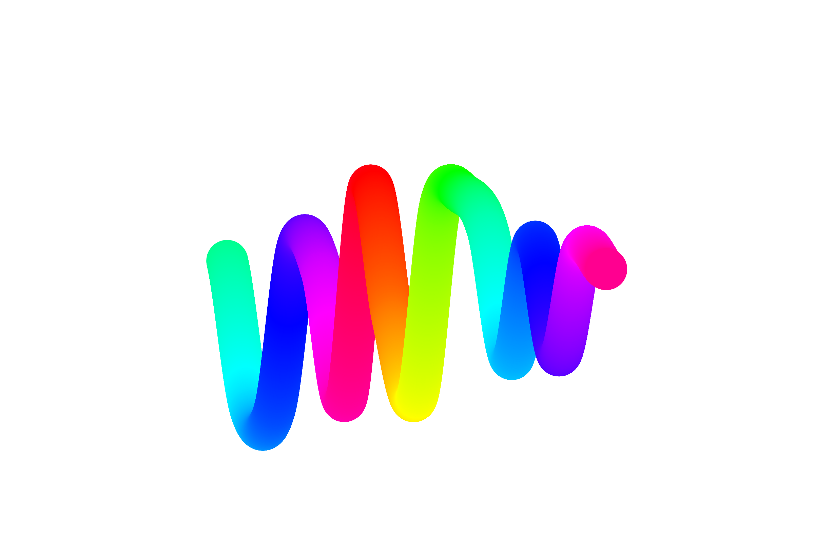

>    Generative art refers to art that in whole or in part has been created with the use of an autonomous system. An autonomous system in this context is generally one that is non-human and can independently determine features of an artwork that would otherwise require decisions made directly by the artist. In some cases the human creator may claim that the generative system represents their own artistic idea, and in others that the system takes on the role of the creator.

Generative art has been around for as long as computers were, making its first appearance in 1965 thanks to the work of [Georg Nees](http://dada.compart-bremen.de/item/agent/15) and [Frieder Nake](http://dada.compart-bremen.de/item/agent/68).
It's only natural that an artistic process so dependent on technology would drastically change with the evolution of the tools it relies on.

Ethereum in particular has been widely considered as the de-facto standard for Tokenized artworks, also called NFTs (Non-Fungible-Tokens), using the ERC-721 standard.

# NFTs 

NFTs or Non-Fungible-Tokens are Ethereum tokens following the ERC-721 standard.

If you have never used Ethereum tokens, you can think of them as objects (as in traditional OOP objects) on the Ethereum blockchain, often used to represent something that can be money, data, or something more complex such as a share of ownership of an organization.

NFTs in particular are tokens that represent an artwork, that can be an image, a video or even 3D models that are rendered in real-time (rendering is done off-chain, based on properties stored inside the on-chain token).
They are called **"non fungible"** because each instance of a NFT is unique and not interchangeable like other **fungible** assets would be (think of money, Bitcoin or even Ether).

# ArtBlocks

[ArtBlocks](https://artblocks.io) has become my favorite platform for the distribution generative art. From their website:

>    Art Blocks is a first of its kind storefront for genuinely programmable on demand generative content that is stored immutably on the Ethereum Blockchain. You pick a style that you like, pay for the work, and a randomly generated version of the content is created by an algorithm and sent to your Ethereum account. The resulting piece might be a static image, 3D model, or an interactive experience. Each output is different and there are endless possibilities for the types of content that can be created on the platform.

Each project released on ArtBlocks is coming from a different artist, which creates a generative script that is then stored on the Ethereum blockchain. Users can then iterate over the script from the ArtBlocks' website by sending transactions to the smart contract, until a threshold of mints is reached (i.e. after 1000 artworks created, no more will **ever** be created).

*One of the NFTs distributed by ArtBlocks*

ArtBlocks has been experiencing an insane growth over the past two months since its inception. Releases are sold out in minutes regardless of high or low Ethereum gas fees (each mint costs approximately $20-40 in gas fees + the actual price of the NFT) and the secondary market on OpenSea is thriving, with some of the rarest artworks being sold for over $10.000!

# Conclusions

The mechanism of randomness from traditional generative art is translated and gamified in a revolutionary way. The added thrill of not knowing how your NFT will look and the (relatively) low price of some releases encourages multiple mintings in the hope to find your *perfect* NFT and reminds me of [gacha games](https://en.wikipedia.org/wiki/Gacha_game).

I've personally been addicted to minting Chromie Squiggles, the first project released by ArtBlocks' creator himself.

*A Chromie Squiggle*

I highly suggest checking the platform out, but remember to not treat NFTs as investments. They are infinitely better (and more fun!) when you approach them as collectables or traditional artworks you would buy not for speculation, but for personal enjoyment.